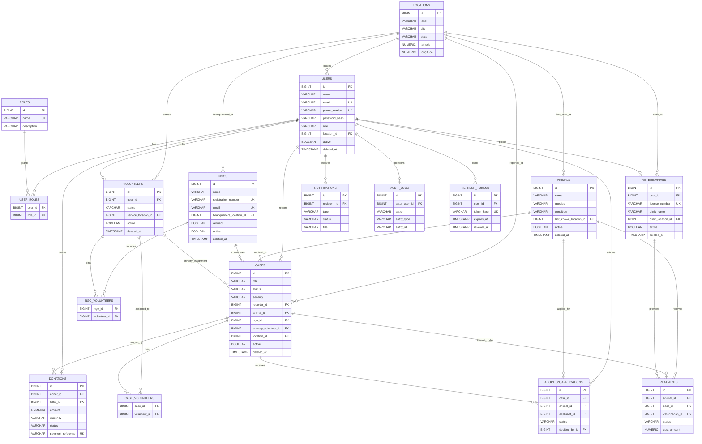

# Karuna Backend ER Diagram

This document reflects the Milestone 2 PostgreSQL domain model and Flyway migrations `V1` through `V5`.

## MongoDB Documents

MongoDB is used for document-style data that should not drive PostgreSQL relational integrity:

| Document | Collection | Purpose |
| --- | --- | --- |
| `AiPrediction` | `ai_predictions` | Stores model/provider prediction output and metadata. |
| `ImageMetadata` | `image_metadata` | Stores image file metadata and labels. |
| `ChatLog` | `chat_logs` | Stores user/case chat transcripts and metadata. |
| `ApplicationLog` | `application_logs` | Stores structured application log events. |

